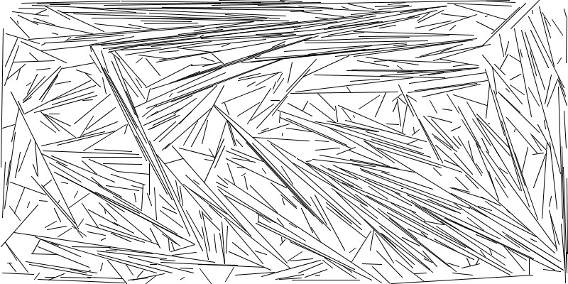

# NotIntersectingLinesGraph
## A graphical exploration written in the language of processing.
> The not intersecting lines graph tries to place a random line
on a board with given lines. The line is tested against all
other lines in the graph. If it's valid it gets added to the graph. 
After a specified number of attempts the graph eventually ends and
saves a jpg image in the output folder.

## Rendered images

## Resources I used
* https://processing.org/
* https://www.geeksforgeeks.org/check-if-two-given-line-segments-intersect/
* https://en.wikipedia.org/wiki/Line%E2%80%93line_intersection
